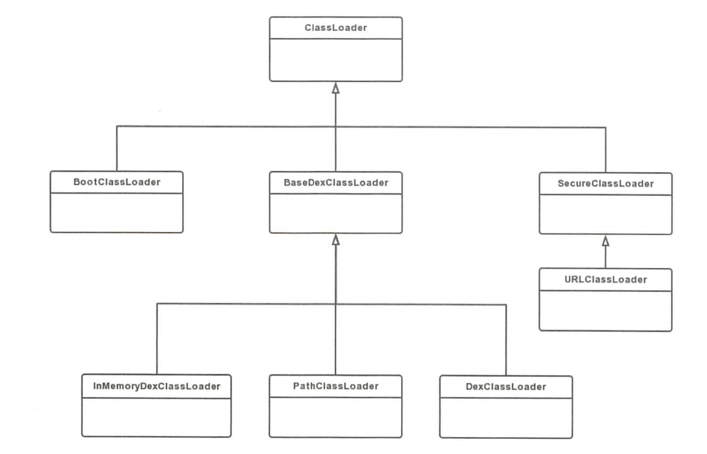

[TOC]

## Android类加载

#### 参考

* [Android进阶解密](https://book.douban.com/subject/30358046/)

### 一、基础知识

#### 1.1 Java类加载

* 详情请查看[Java类加载](必备Java知识/反射与类加载/类加载/Java类加载.md)

###  二、三种类加载器

#### 2.1 BootClassLoader

##### 2.1.1 概述

* BootClassLoader实例在Android系统启动的时候被创建，**用于加载一些Android系统框架的类**，其中就包括APP用到的一些系统类。(与Java中的BootstrapClassLoader不同，它并不是由C/C++代码实现，而是由Java实现的,BootClassLoader是ClassLoader的内部类)

##### 2.1.2 源码

```java
class BootClassLoader extends ClassLoader {

    private static BootClassLoader instance;

    @FindBugsSuppressWarnings("DP_CREATE_CLASSLOADER_INSIDE_DO_PRIVILEGED")
    public static synchronized BootClassLoader getInstance() {
        if (instance == null) {
            instance = new BootClassLoader();
        }

        return instance;
    }
    ......
}
```

* BootClassLoader是ClassLoader的内部类，并继承自ClassLoader
* 使用static保证BootClassLoader是一个单例类
* 使用synchronized保证线程安全
* BootClassLoader使用的是默认修饰符，所以在同一个包才可以访问，因此在应用程序中无法直接调用

#### 2.2 BaseDexClassLoader

##### 2.2.1 概述

* 由于DexClassLoader和PathClassLoader都继承自BaseDexClassLoader，所以我们先看看BaseDexClassLoader

##### 2.2.2 源码

* 构造方法

```java
 public BaseDexClassLoader(String dexPath, File optimizedDirectory,
		String librarySearchPath, ClassLoader parent) {
	super(parent);
    this.pathList = new DexPathList(this, dexPath, librarySearchPath, null);

    if (reporter != null) {
    	reporter.report(this.pathList.getDexPaths());
	}
}
```

- dexPath ：指目标类所在的apk或jar文件的路径，比如像这样的："/data/app/com.yeoggc.myapplication-1/base.apk"。如果要包含多个路径，路径之间用冒号分隔。
- optimizedDirectory：解压的dex文件存储路径，也就是类加载器把dexPath路径上的文件，进行ODEX优化到内部存储路径，该路径就是由optimizedDirectory指定的。如果为null，那么就采用默认的系统路径。（不能是任意目录，它必须是程序所属的目录才行，比如：data/data/包名/xxx）
- libraryPath：指目标类中所使用到的C/C++库存放的路径。
- parent：父加载器

#### 2.3 DexClassLoader

##### 2.3.1 概述

* DexClassLoader可以加载dex文件以及包含dex的压缩文件（apk和jar文件），不管加载哪种文件，最终都要加载dex文件。
* 可以从包含classes.dex的jar或者apk中，加载类的类加载器, 可用于执行**动态加载**, 但必须是app私有可写目录来缓存odex文件. 能够加载系统没有安装的apk或者jar文件， 因此**很多热修复和插件化方案都是采用DexClassLoader**;

##### 2.3.2 源码

```java
public class DexClassLoader extends BaseDexClassLoader {
    public DexClassLoader(String dexPath, String optimizedDirectory,
            String librarySearchPath, ClassLoader parent) {
        super(dexPath, new File(optimizedDirectory), librarySearchPath, parent);
    }
}
```

* 继承自BaseDexClassLoader

#### 2.4 PathClassLoader

##### 2.4.1 概述

*  主要用于**系统和app的类加载器**,其中optimizedDirectory为null, 采用默认目录/data/dalvik-cache/
* 显然PathClassLoader无法定义解压的dex文件存储路径，因此PathClassLoader通常用来加载已经安装的apk的dex文件

##### 2.4.2 源码

```java
public class PathClassLoader extends BaseDexClassLoader {

    public PathClassLoader(String dexPath, ClassLoader parent) {
        super(dexPath, null, null, parent);
    }

    public PathClassLoader(String dexPath, String librarySearchPath, ClassLoader parent){
         super(dexPath, null, librarySearchPath, parent);
    }
}
```

* 继承自BaseDexClassLoader

#### 2.5 ClassLoader继承关系



* ClassLoader 是一个抽象类，其中定义了 ClassLoader 的主要功能。 
* BootClassLoader 是它的内部类。 
* SecureClassLoader 类和 JDK8 中的 SecureClassLoader 类的代码是一样的，它继承了 抽象类 ClassLoader ，SecureClassLoader 并不是 ClassLoader 的实现类，而是拓展了 ClassLoader 类加入了权限方面的功能，加强了 ClassLoader 的安全性
*  URLClassLoader 类和 JDK 中的 URLClassLoader 类的代码是一样的，它继承自 SecureClassLoader ，用来通过 URL 路径从 jar 文件和文件夹中加载类和资源
* InMemoryDexClassLoader Android 8.0 新增的类加载器，继承自 BaseDexClassLoader ，用于加载内存中的 dex 文件。
* BaseDexClassLoader 继承自 ClassLoader ，是抽象类 ClassLoader 的具体实现类
* PathClassLoader、 DexClassLoader、 InMemoryDexClassLoader 都继承自BaseDexClassLoader 

### 三、双亲委托模式

#### 3.1 概述

* Android的双亲委托模式和Java的类似，详情请查看[Java类加载](必备Java知识/反射与类加载/类加载/Java类加载.md)

#### 3.2 源码

```java
protected Class<?> loadClass(String name, boolean resolve)
	throws ClassNotFoundException
{
	//先从缓存中查找此类是否已经加载过了 加载过了就不用执行下面操作了
    Class<?> c = findLoadedClass(name);
    if (c == null) {
    	try {
        	if (parent != null) {
                //如果没找到 则交给父类加载器去加载
            	c = parent.loadClass(name, false);
			} else {
                //如果返回的是null 则说明此时父加载器是BootstrapClassLoader
                //所以交给BootstrapClassLoader去加载，此方法返回的是null
            	c = findBootstrapClassOrNull(name);
			}
		} catch (ClassNotFoundException e) {
        	
		}

        if (c == null) {
        	//如果都没有找到，则通过自定义实现的findClass去查找并加载
            c = findClass(name);
		}
	}
    return c;
}
```

* 这部分也和Java的类似，详情请查看[Java类加载](必备Java知识/反射与类加载/类加载/Java类加载.md)

#### 四、自定义ClassLoader

#### 4.1 DexPathList

* 就跟它的名字那样，该类**主要用来查找Dex、SO库的路径**，并这些路径整体呈一个数组。

#### 4.2 DexFile

* 用来描述Dex文件，**Dex的加载以及Class的查找**都是由该类调用它的native方法完成的。（DexFile为DexPathList的内部类Element的成员属性）

#### 4.3 步骤

* 继承ClassLoader，然后重写findClass方法
* 然后使用defineClass方法，获取Class对象的实例

#### 4.4 BaseDexClassLoader

* 我们可以查看baseDexClassLoader是怎么实现的，需要自定义的时候，可以进行模仿

##### 4.4.1 findClass

* BaseDexClassLoader#findClass

```java
@Override
protected Class<?> findClass(String name) throws ClassNotFoundException {
	List<Throwable> suppressedExceptions = new ArrayList<Throwable>();
    Class c = pathList.findClass(name, suppressedExceptions);
    if (c == null) {
    	ClassNotFoundException cnfe = new ClassNotFoundException(
        		"Didn't find class \"" + name + "\" on path: " + pathList);
		for (Throwable t : suppressedExceptions) {
        	cnfe.addSuppressed(t);
		}
        throw cnfe;
	}
    return c;
}
```

* 通过pathList.findClass获取的Class的实例，其中pathList是DexPathList对象

##### 4.4.2 findClass

* DexPathList#findClass

```java
public Class<?> findClass(String name, List<Throwable> suppressed) {
	for (Element element : dexElements) {
    	Class<?> clazz = element.findClass(name, definingContext, suppressed);
        if (clazz != null) {
        	return clazz;
		}
	}

    if (dexElementsSuppressedExceptions != null) {
    	suppressed.addAll(Arrays.asList(dexElementsSuppressedExceptions));
	}
    return null;
}
```

* 遍历dexElements，然后调用element.findClass方法去获取Class对象
* element是Element对象，Element是DexPathList的静态内部类

##### 4.4.3 findClass

* DexPathList#Element#findClass

```java
public Class<?> findClass(String name, ClassLoader definingContext,
		List<Throwable> suppressed) {
	return dexFile != null 
        ? dexFile.loadClassBinaryName(name, definingContext, suppressed)
        : null;
}
```

* 如果dexFile不为null的话，会调用dexFile.loadClassBinaryName方法
* dexFile是DexFile对象，所以会调用DexFile的loadClassBinaryName方法

##### 4.4.4 loadClassBinaryName

* DexFile#loadClassBinaryName

```java
public Class loadClassBinaryName(String name, ClassLoader loader, List<Throwable> suppressed) {
	return defineClass(name, loader, mCookie, this, suppressed);
}
```

* 调用defineClass方法

##### 4.4.5 defineClass

* DexFile#defineClass

```java
private static Class defineClass(String name, ClassLoader loader, Object cookie,
								DexFile dexFile, List<Throwable> suppressed) {
	Class result = null;
    try {
    	result = defineClassNative(name, loader, cookie, dexFile);
	} catch (NoClassDefFoundError e) {
    	if (suppressed != null) {
        	suppressed.add(e);
		}
	} catch (ClassNotFoundException e) {
    	if (suppressed != null) {
        	suppressed.add(e);
		}
	}
	return result;
}
```

* 会调用defineClassNative方法
* defineClassNative是一个Native方法，用来加载dex的相关文件。

### 五、热修复

#### 5.1 概述

##### 5.1.1 DexClassLoader和PathClassLoader

* 可以发现这两个类的构造函数最大的差别就是DexClassLoader提供了optimizedDirectory，而PathClassLoader则没有，optimizedDirectory正是用来存放odex文件的地方，所以可以利用DexClassLoader实现动态加载。

##### 5.1.2 Dex文件加载、类的查找加载的序列图


* 从上图Dex加载的流程可以看出，optimizedDirectory决定了调用哪一个DexFile的构造函数。

* PathClassLoader调用的DexFile构造函数

```java
DexFile(File file, ClassLoader loader, DexPathList.Element[] elements)
        throws IOException {
    this(file.getPath(), loader, elements);
}
```

* DexClassLoader调用的DexFile构造函数

```java
private DexFile(String sourceName, String outputName, int flags, ClassLoader loader,
        DexPathList.Element[] elements) throws IOException {
    if (outputName != null) {
        try {
            String parent = new File(outputName).getParent();
            if (Libcore.os.getuid() != Libcore.os.stat(parent).st_uid) {
                throw new IllegalArgumentException("Optimized data directory " + parent
                        + " is not owned by the current user. Shared storage cannot protect"
                        + " your application from code injection attacks.");
            }
        } catch (ErrnoException ignored) {
            // assume we'll fail with a more contextual error later
        }
    }

    mCookie = openDexFile(sourceName, outputName, flags, loader, elements);
    mFileName = sourceName;
    //System.out.println("DEX FILE cookie is " + mCookie + " sourceName=" + sourceName + " outputName=" + outputName);
}
```

* 所以你可以看到DexClassLoader在加载Dex文件的时候比PathClassLoader多了一个openDexFile()方法，该方法调用的是native方法openDexFileNative()方法。
* 这个方法并不是真的打开Dex文件，而是将Dex文件以一种mmap的方式映射到虚拟机进程的地址空间中去，实现文件磁盘地址和进程虚拟地址空间中一段虚拟地址的一一对映关系。实现这样的映射关系后，虚拟机进程就可以采用指针的方式读写操作这一段内存，而系统会自动回写脏页面到对应的文件磁盘上，即完成了对文件的操作而不必再调用read,write等系统调用函数。

##### 5.1.3 小结

* DexClassLoader可以指定DexFile的路径

#### 5.2 原理

* **因此，类加载方案的实现，就是将补丁 dex 对应的 `Element` 插入到应用对应的加载器的 `pathList` 的 `dexElements` 数组的靠前位置，从而使得后面同名的 Class 不被加载。**

#### 5.3 步骤

* 创建 `BaseDexClassLoader` 的子类 `DexClassLoader` 加载器

* 加载修复好的 class.dex (服务器下载的修复包)

* 将自有的和系统的 `dexElements` 进行合并，并设置自有的 `dexElements` 优先级

* 通过反射技术，赋值给系统的 `pathList`

#### 5.2 核心代码

```java
public void doHotFix(Context context) throws IllegalAccessException, NoSuchFieldException, ClassNotFoundException {
    if (context == null) {
        return;
    }
    // 补丁存放目录为 /storage/emulated/0/Android/data/com.lxbnjupt.hotfixdemo/files/patch
    // 注意，这里的 dexFile 是一个目录
    File dexFile = context.getExternalFilesDir(DEX_DIR);
    if (dexFile == null || !dexFile.exists()) {
        Log.e(TAG,"热更新补丁目录不存在");
        return;
    }
    // 得到 new DexClassLoader 时需要的存储路径
    File odexFile = context.getDir(OPTIMIZE_DEX_DIR, Context.MODE_PRIVATE);
    if (!odexFile.exists()) {
        odexFile.mkdir();
    }
    // 获取 /storage/emulated/0/Android/data/com.lxbnjupt.hotfixdemo/files/patch 
    // 目录下的所有文件，用于找出里面的补丁 dex
    File[] listFiles = dexFile.listFiles();
    if (listFiles == null || listFiles.length == 0) {
        return;
    }
    
    // 获取补丁 dex 文件路径集合
    String dexPath = getPatchDexPath(listFiles);
    String odexPath = odexFile.getAbsolutePath();
    // 获取应用对应的 PathClassLoader
    PathClassLoader pathClassLoader = (PathClassLoader) context.getClassLoader();
    
    // 构建 DexClassLoader，用于加载补丁 dex
    // DexClassLoader 构造方法的四个参数：
    //      第一个：dex 文件相关路径集合，多个路径用文件分隔符分隔，默认文件分隔符为 :
    //      第二个：解压的 dex 文件的存储路径，必须是一个内部存储路径
    //      第三个：包含 C/C++ 库的路径集合，可以为 null
    //      第四个：父加载器
    DexClassLoader dexClassLoader = new DexClassLoader(dexPath, odexPath, null, pathClassLoader);
    // 这里要新 new 一个 DexClassLoader 的原因就是为了借助系统来构建出补丁 dex 对应
    // 的 Element 元素的数组，从而插入到应用的 PathClassLoader 的 
    // pathList.dexElements 中
    
    // 通过反射获取 PathClassLoader 的 Element 数组
    Object pathElements = getDexElements(pathClassLoader);
    // 获取构建的 DexClassLoader 的 Element 数组
    Object dexElements = getDexElements(dexClassLoader);
    // 合并 Element 数组
    Object combineElementArray = combineElementArray(pathElements, dexElements);
    // 通过反射，将合并后的 Element 数组赋值给 PathClassLoader 中 pathList 里面的
    // dexElements 变量
    setDexElements(pathClassLoader, combineElementArray);
}
```


