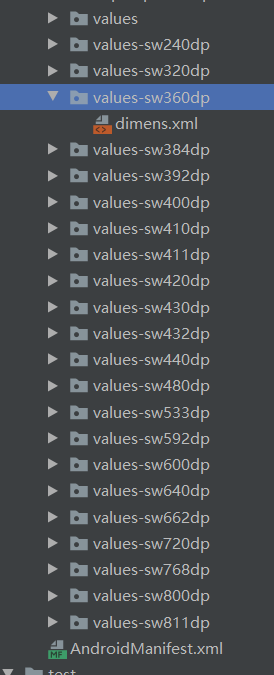

# SmallestWidth适配方案

### 参考链接

* [骚年你的屏幕适配方式该升级了!-SmallestWidth 限定符适配方案](https://www.jianshu.com/p/2aded8bb6ede)

## 一、原理

### 1.1 引入

这个方案和[宽高限定符](设计思想解读开源框架/屏幕适配/宽高限定符适配.html)适配大同小异，可以说SmallestWidth适配方案是宽高限定符的升级版。同理，**同时通过系统特定的规则来选择对应的文件，不同的是SmallestWidth使用的是dp**。

### 1.2 原理

* SmallestWidth适配，也叫做sw限定符适配。Android会识别屏幕可用高度和宽度的最小尺寸的dp值（其实就是手机的宽度值），然后根据识别到的结果去资源文件中寻找对应限定符的文件夹下的资源文件。
* 开发者先在项目中根据主流屏幕的 **最小宽度 (smallestWidth)** 生成一系列 **`values-sw<N>dp`** 文件夹 (含有 **dimens.xml** 文件)，当把项目运行到设备上时，系统会根据当前设备屏幕的 **最小宽度 (smallestWidth)** 去匹配对应的  **`values-sw<N>dp`** 文件夹，而对应的  **`values-sw<N>dp`**  文件夹中的 **dimens.xml** 文字中的值，又是根据当前设备屏幕的 **最小宽度 (smallestWidth)** 而定制的，所以一定能适配当前设备。
* 与宽高限定符适配方案不同的是，如果系统找不到当前设备最小宽度对应的 **`values-sw<N>dp`**文件夹，并不像宽高限定符号那样使用**values#dimens.xml**。而是会**向下**寻找与其最小宽度相接近的文件夹**`values-sw<N>dp`**下的**dimens.xml**，这样大大提高了容错率。



### 1.3 其他场景

**想让屏幕宽度随着屏幕的旋转而做出改变**

* 生成一套**`values-w<N>dp`**资源文件(没有s)

**想区分屏幕的方向来**

* 生成一套**`values-sw<N>dp-land`**资源文件(**最小宽度N，横向**)
* 生成一套**`values-sw<N>dp-port`**资源文件(**最小宽度N，纵向**)

## 二、Dimens生成原理

### 2.1 最小宽度计算

* 假设设备为 **1920 \* 1080**、**480 dpi**
* 我们已知最小的那边肯定是1080。我们需要计算出总的dp值，`px=dp*(dpi/160)`。所以`总dp=1080/(480/160)=360dp`。计算出最小宽度为360dp，自然系统会去找到对应的**values-sw360dp**文件夹下的**dimens.xml**文件。

### 2.2 dimens.xml生成原理

`dimens.xml`的生成原理和宽高限定符适配的原理类似。第一要选择**最小宽度基准值**，第二要**`生成values-sw<N>文件夹`**

#### 2.2.1 最小宽度基准值

* 假设我们现在把**最小宽度基准值**定为360dp的话，而且我们最小单位是1dp的话，那我们就可以把屏幕宽度分成360份，每份都是1dp，所有理所当然的`values-sw360dp`中的`dimens.xml`的内容如下。

  ```xml
  <?xml version="1.0" encoding="utf-8"?>
  <resources>
      <dimen name="dp_1">1.0dp</dimen>
      <dimen name="dp_2">2.0dp</dimen>
      ......
      <dimen name="dp_359">359.0dp</dimen>
      <dimen name="dp_360">360.0dp</dimen>
      
      /**********字体适配***************/
      <dimen name="sp_12">12.0sp</dimen>
      ......
      <dimen name="sp_24">24.0sp</dimen>
  </resources>
  ```

#### 2.2.2 生成其他的文件夹

* 那我们看下`values-sw400dp`文件夹的`dimens.xml`的情况。

* 通过宽高限定符适配的计算方式，我们应该也知道SW限定符适配的计算方式，计算公式：**N*(当前文件夹dp/基准dp)**

* 例如**dp_1=1*(400/360)=1.1111112dp**

* 例如**dp_2=2*(400/360)=2.2222223dp**

  ```xml
  <?xml version="1.0" encoding="utf-8"?>
  <resources>
      <dimen name="dp_1">1.1111112dp</dimen>
      <dimen name="dp_2">2.2222223dp</dimen>
      ......
  	<dimen name="dp_359">398.88892dp</dimen>
      <dimen name="dp_360">400.00003dp</dimen>
      
       /**********字体适配***************/
      <dimen name="sp_12">13.333334sp</dimen>
      ......
      <dimen name="sp_24">26.666668sp</dimen>
  </resources>
  ```


## 三、实例

  * 假如设计图是`360dp`的，有一个控件上标注的是`100dp*120dp`。那对于我们的布局文件就很方便就是

    ```xml
    android:layout_width="@dimen/dp_100"
    android:layout_height="@dimen/dp_120"
    ```

* 假如设计图是`480dp`的，控件上标注的是`100dp*120dp`，那布局文件就是`X*(480/360)=100`得出X等于75。`Y*(480/360)=90`得出Y等于90

  ```xml
  android:layout_width="@dimen/dp_75"
  android:layout_height="@dimen/dp_90"
  ```

## 四、Dimens文件生成脚本

* DimenDPThread

  ```java
  public class DimenDPThread implements Runnable{
  
      private String path ;
      private int wBaseDp ;
      private static List<DimensDP> dimensData = new ArrayList<>();
  
      static{
          dimensData.add(new DimensDP(240));
          dimensData.add(new DimensDP(320));
          dimensData.add(new DimensDP(360));
          dimensData.add(new DimensDP(384));
          dimensData.add(new DimensDP(392));
          dimensData.add(new DimensDP(400));
          dimensData.add(new DimensDP(410));
          dimensData.add(new DimensDP(411));
          dimensData.add(new DimensDP(420));
          dimensData.add(new DimensDP(430));
          dimensData.add(new DimensDP(432));
          dimensData.add(new DimensDP(440));
          dimensData.add(new DimensDP(480));
          dimensData.add(new DimensDP(533));
          dimensData.add(new DimensDP(592));
          dimensData.add(new DimensDP(600));
          dimensData.add(new DimensDP(640));
          dimensData.add(new DimensDP(662));
          dimensData.add(new DimensDP(720));
          dimensData.add(new DimensDP(768));
          dimensData.add(new DimensDP(800));
          dimensData.add(new DimensDP(811));
  
      }
  
      public void setPath(String path) {
          this.path = path;
      }
  
      public void setwBaseDp(int wBaseDp) {
          this.wBaseDp = wBaseDp;
      }
  
      @Override
      public void run() {
  
          StringBuffer sb = new StringBuffer();
          for(int i=0; i<dimensData.size(); i++){
  
              DimensDP dimensDP = dimensData.get(i);
              String parentName = path + "values-sw" + dimensDP.getSwDp() + "dp";
              File file = new File(parentName);
              if(!file.exists()){
                  file.mkdirs();
              }
  
              /************************编写dimens.xml文件*******************************/
              File dim = new File(file, "dimens.xml");
              dim.delete();
              writeFile(dim, sb, dimensDP);
  
          }
  
      }
  
      private void writeFile(File lay, StringBuffer sb, DimensDP dimens){
  
          //切勿使用FileWriter写数据，它是默认使用ISO-8859-1 or gb2312，不是utf-8,并且没有setEncoding方法
          BufferedWriter fw = null;
          try {
              fw = new BufferedWriter(new OutputStreamWriter(new FileOutputStream(lay,true),"UTF-8"));
  
              fw.write("<?xml version=\"1.0\" encoding=\"utf-8\"?>" +"\n");
              fw.write("<resources>" + "\n");
  
              StringBuffer sp = new StringBuffer();
              for(int k = 1; k<wBaseDp+1; k++){
                  sb.setLength(0);
                  sb.append("    <dimen name=\"dp_"+k+"\">");
                  float dp = ((float)dimens.getSwDp()/wBaseDp) * k;
                  sb.append(dp+"dp</dimen>" + "\n");
                  fw.write(sb.toString());
                  if (k >= 12 && k <=24 & k%2 == 0) {
                      sp.append("    <dimen name=\"sp_"+k+"\">");
                      float value = ((float)dimens.getSwDp()/wBaseDp) * k;
                      sp.append(value+"sp</dimen>" + "\n");
                  }
              }
              fw.write("\n");
              fw.write("    /**********字体适配***************/" + "\n");
              fw.write("\n");
              fw.write(sp.toString());
              fw.write("</resources>");
          } catch (IOException e) {
              e.printStackTrace();
          }finally {
              try {
                  fw.close();
              } catch (IOException e) {
                  e.printStackTrace();
              }
          }
      }
  
  }
  ```

* DimensDP

  ```java
  public class DimensDP {
      private int swDp;
  
      public DimensDP(int swDp) {
          super();
          this.swDp = swDp;
      }
  
      public int getSwDp() {
          return swDp;
      }
  
      public void setSwDp(int swDp) {
          this.swDp = swDp;
      }
  }
  ```

* 使用

  ```java
  DimenDPThread dimenDPThread = new DimenDPThread();
  dimenDPThread.setwBaseDp(360);
  dimenDPThread.setPath("E:\\res\\dp\\");
  
  new Thread(dimenDPThread).start();
  ```

## 五、优缺点

### 5.1 优点

* 非常稳定，极低概率出现意外

* 不会有任何性能的损耗

* 适配范围可自由控制，不会影响其他三方库

* 在插件的配合下，学习成本低
* 相比宽高限定符适配而言，容错率更高

### 5.2 缺点

* 在布局中引用 **dimens** 的方式，虽然学习成本低，但是在日常维护修改时较麻烦

* 侵入性高，如果项目想切换为其他屏幕适配方案，因为每个 **Layout** 文件中都存在有大量 **dimens** 的引用，这时修改起来工作量非常巨大，切换成本非常高昂。

* 无法覆盖全部机型，想覆盖更多机型的做法就是生成更多的资源文件，但这样会增加 **App** 体积，在没有覆盖的机型上还会出现一定的误差，所以有时需要在适配效果和占用空间上做一些抉择

* 如果使用 **sp**，也需要生成一系列的 **dimens**，导致再次增加 **App** 的体积

* 不能自动支持横竖屏切换时的适配，如上文所说，如果想自动支持横竖屏切换时的适配，需要使用 **`values-w<N>dp`** 或 **屏幕方向限定符** 再生成一套资源文件，这样又会再次增加 **App** 的体积

* 不能以高度为基准进行适配，考虑到这个方案的名字本身就叫 **最小宽度限定符适配方案**，所以在使用这个方案之前就应该要知道这个方案只能以宽度为基准进行适配，

  

  

  
