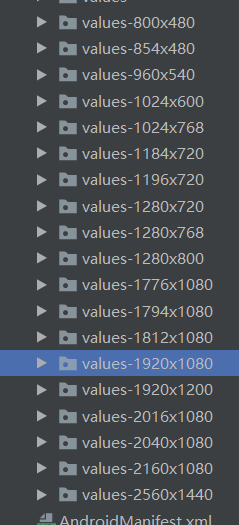

[TOC]
# 宽高限定符适配

## 一、原理

* 为了高效的实现UI开发，出现了宽高限定符适配。简单说，就是在`res`目录下穷举市面上所有的Android手机的宽高像素值。然后对应创建`values-高-宽`文件夹，尽可能的穷举创建所有文件夹。选中一个为基准分辨率，然后生产其他文件夹的`dimens`。Android系统会根据文件名称去寻找相匹配的。

  

## 二、Dimens生成原理

* 选定一种分辨率为基准分辨率，我们这里选择`1080*1920`分辨率为基准分辨率。然后把宽和高分成对应的1080和1920份。那这样的话每一份就是1px了。我们会在每个文件夹下生成两个文件，分别为`lay_x.xml`和`lay_y.xml`。对于基准分辨率的文件夹`values-1920x1080`大概内容如下所示。

  * lay_x.xml

    ```xml
    <?xml version="1.0" encoding="utf-8"?>
    <resources>
        <dimen name="x1">1.0px</dimen>
        <dimen name="x2">2.0px</dimen>
        .....
    	<dimen name="x1079">1079.0px</dimen>
        <dimen name="x1080">1080.0px</dimen>
    </resources>
    ```

  * lay_y.xml

    ```xml
    <?xml version="1.0" encoding="utf-8"?>
    <resources>
        <dimen name="y1">1.0px</dimen>
        <dimen name="y2">2.0px</dimen>
    	......
        <dimen name="y1919">1919.0px</dimen>
        <dimen name="y1920">1920.0px</dimen>
    </resources>
    ```

* 对于其他的文件夹，例如`1280*720`的文件夹`values-1280x720`。则需要进行计算。

* **计算公式**：`X*(实际分辨率/基准分辨率)= px(X为份额)`

  * 如`x1=1*(1280/1920)=0.6666667px`

  * 如`x2=2*(1280/1920)=1.3333334px`

  * 如`y1=1*(720/1080)=0.6666667px`

  * 其他的同理

  * lay_x.xml

    ```xml
    <?xml version="1.0" encoding="utf-8"?>
    <resources>
        <dimen name="x1">0.6666667px</dimen>
        <dimen name="x2">1.3333334px</dimen>
        ......
    	<dimen name="x1079">719.3334px</dimen>
        <dimen name="x1080">720.0px</dimen>
    </resources>
    ```

  * lay_y.xml

    ```xml
    <?xml version="1.0" encoding="utf-8"?>
    <resources>
        <dimen name="y1">0.6666667px</dimen>
        <dimen name="y2">1.3333334px</dimen>
        ......
        <dimen name="y1919">1279.3334px</dimen>
        <dimen name="y1920">1280.0px</dimen>
    </resources>
    ```

## 三、实例

  * 假如设计图是`1920x1080`的，有一个控件上标注的是`360px*480px`。那对于我们的布局文件就很方便就是

    ```xml
    android:layout_width="@dimen/x360"
    android:layout_height="@dimen/y480"
    ```

* 假如设计图是`1280*720`的，控件上标注的是`360px*480px`，那布局文件就是`X*(720/1080)=360`得出X等于540。`Y*(1280/1920)=480`得出Y等于

  ```xml
  android:layout_width="@dimen/x540"
  android:layout_height="@dimen/y720"
  ```

## 四、dimens文件生成脚本

* DimenPXThread

```java
public class DimenPXThread implements Runnable{

    private String path ;
    private int baseWidth;
    private int baseHeight ;
    private static List<DimensPX> dimensData = new ArrayList<>();

    static{
        dimensData.add(new DimensPX(480,800));
        dimensData.add(new DimensPX(480,854));
        dimensData.add(new DimensPX(540,960));
        dimensData.add(new DimensPX(600,1024));
        dimensData.add(new DimensPX(768,1024));
        dimensData.add(new DimensPX(720,1184));
        dimensData.add(new DimensPX(720,1196));
        dimensData.add(new DimensPX(720,1280));
        dimensData.add(new DimensPX(768,1280));
        dimensData.add(new DimensPX(800,1280));
        dimensData.add(new DimensPX(1080,1776));
        dimensData.add(new DimensPX(1080,1794));
        dimensData.add(new DimensPX(1080,1812));
        dimensData.add(new DimensPX(1080,1920));
        dimensData.add(new DimensPX(1200,1920));
        dimensData.add(new DimensPX(1080,2016));
        dimensData.add(new DimensPX(1080,2040));
        dimensData.add(new DimensPX(1080,2160));
        dimensData.add(new DimensPX(1440,2560));

    }

    public void setPath(String path) {
        this.path = path;
    }

    public void setBasePX(int baseWidth,int baseHeight){
        this.baseWidth = baseWidth;
        this.baseHeight = baseHeight;
    }

    @Override
    public void run() {
        StringBuffer sb = new StringBuffer();
        for(int i=0; i<dimensData.size(); i++){

            DimensPX dimensPX = dimensData.get(i);
            String parentName = path + "values-"+dimensPX.getyPX() + "x" + dimensPX.getxPX();
            File file = new File(parentName);
            if(!file.exists()){
                file.mkdirs();
            }

            /************************编写lay_x.xml文件*******************************/

            File lay_x = new File(file, "lay_x.xml");
            lay_x.delete();
            writeFile(lay_x, sb, dimensPX,"x");

            /**************************编写lay_y.xml文件********************************/

            File lay_y = new File(file, "lay_y.xml");
            lay_y.delete();
            writeFile(lay_y, sb, dimensPX,"y");

        }

    }

    private void writeFile(File lay, StringBuffer sb, DimensPX dimens, String type){

        //切勿使用FileWriter写数据，它是默认使用ISO-8859-1 or gb2312，不是utf-8,并且没有setEncoding方法
        BufferedWriter fw = null;
        try {
            fw = new BufferedWriter(new OutputStreamWriter(new FileOutputStream(lay,true),"UTF-8"));

            fw.write("<?xml version=\"1.0\" encoding=\"utf-8\"?>" +"\n");
            fw.write("<resources>" + "\n");

            int bound;
            if("x".equals(type)){
                bound = baseWidth;
            }else{
                bound = baseHeight;
            }

            for(int k=1; k<bound+1; k++){

                sb.setLength(0);
                sb.append("    <dimen name=\""+type+k+"\">");

                float px = 0.0f;
                if("x".equals(type)){
                    px = ((float)dimens.getxPX()/baseWidth) * k;
                }else{
                    px = ((float)dimens.getyPX()/baseHeight) * k;
                }

                sb.append(px+"px</dimen>" + "\n");
                fw.write(sb.toString());
            }
            fw.write("</resources>");
        } catch (IOException e) {
            e.printStackTrace();
        }finally {
            try {
                fw.close();
            } catch (IOException e) {
                e.printStackTrace();
            }
        }
    }

}
```

* DimensPX

```java
public class DimensPX {
    private int xPX;
    private int yPX;

    public DimensPX(int xPX, int yPX) {
        super();
        this.xPX = xPX;
        this.yPX = yPX;
    }

    public int getxPX() {
        return xPX;
    }

    public void setxPX(int xPX) {
        this.xPX = xPX;
    }

    public int getyPX() {
        return yPX;
    }

    public void setyPX(int yPX) {
        this.yPX = yPX;
    }

}
```

* 使用实例

```java
public class Solution {
    public static void main(String[] args) {
        DimenPXThread dimenPXThread = new DimenPXThread();
        dimenPXThread.setBasePX(1080, 1920);//设置基准分辨率
        dimenPXThread.setPath("E:\\res\\");//设置文件输出路径

        new Thread(dimenPXThread).start();
    }
}
```

## 五、问题

* **但是这个方案有一个致命的缺陷，那就是需要精准命中才能适配**，比如`1920x1080`的手机就一定要找到`1920x1080`的限定符，否则就只能用统一的默认的`dimens`文件了。而使用默认的尺寸的话，UI就很可能变形，简单说，就是容错机制很差。

