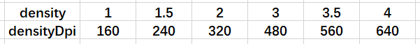

[TOC]
- <!-- TOC -->
  - [ 一、屏幕适配基础知识](#一、屏幕适配基础知识)
    - [ 参考链接](#参考链接)
    - [ 1.1 基础知识](#11-基础知识)
      - [ 1.1.1 px](#111-px)
      - [ 1.1.2 ppi](#112-ppi)
      - [ 1.1.3 dpi](#113-dpi)
      - [ 1.1.4 dp](#114-dp)
    - [ 1.2 DisplayMetrics类](#12-displaymetrics类)
      - [ 2.1.1 density](#211-density)
      - [ 2.1.2 densityDpi](#212-densitydpi)
  - [ 二、dp设配方案](#二、dp设配方案)
    - [ 2.1 原理](#21-原理)
    - [ 2.2 问题](#22-问题)
  <!-- /TOC -->
## 一、屏幕适配基础知识

### 参考链接

* [骚年你的屏幕适配方式该升级了!-今日头条适配方案](https://www.jianshu.com/p/55e0fca23b4f?utm_source=oschina-app)

### 1.1 基础知识

#### 1.1.1 px

* 像素(piexl)，指的是屏幕上的物理点，最小的独立显示单位。

#### 1.1.2 ppi

**含义**

* 每英寸像素数(Pixels Per Inch)。

**计算公式**

* 像素数量/英寸

* `√(水平像素值²+竖直像素值²)/对角线英寸`

**例子**

* 小米9se，分辨率`1080×2340`，5.97英寸。
* 所以`ppi=√(1080²+2340²)/5.97=432`。432ppi。

#### 1.1.3 dpi

**含义**

* 每英寸点(Dots Per Inch)

**计算**

* Android中的dpi是由ppi的值来确定的，可以参考下图。但是Android的dpi只有确定的几种。比如小米9se的ppi为432ppi。但是通过代码输出来的是480dpi。

* 

* ```java
  public static final int DENSITY_LOW = 120;
  public static final int DENSITY_MEDIUM = 160;
  public static final int DENSITY_TV = 213;
  public static final int DENSITY_HIGH = 240;
  public static final int DENSITY_260 = 260;
  public static final int DENSITY_280 = 280;
  public static final int DENSITY_300 = 300;
  public static final int DENSITY_XHIGH = 320;
  public static final int DENSITY_340 = 340;
  public static final int DENSITY_360 = 360;
  public static final int DENSITY_400 = 400;
  public static final int DENSITY_420 = 420;
  public static final int DENSITY_XXHIGH = 480;
  public static final int DENSITY_560 = 560;
  public static final int DENSITY_XXXHIGH = 640;
  ```

**代码获取**

* `getResources().getDisplayMetrics().densityDpi`来获取dpi。

#### 1.1.4 dp

**含义**

* 像素无关点(Density-Independent pixel)，这个是Android定义的虚拟值。

**px换算公式**

* `px = dp * (dpi / 160)`

**例子**

* 对于小米9se而言。
* `1dp*(480/160)=3px`也就是1dp=3px

### 1.2 DisplayMetrics类

#### 2.1.1 density

```java
float density = displayMetrics.density;
```

* `density`值，例如小米9se，上面已经说了`1dp=3px`，所以`density`等于3

#### 2.1.2 densityDpi

```java
int densityDpi = displayMetrics.densityDpi;
```

* `densityDpi`也就是上述说的`dpi`。`densityDpi`和`density`的对应关系如下。

* 计算公式：**density=densityDpi/160**

  

## 二、dp设配方案

### 2.1 原理

* 从基础知识我们可以知道，对于不同的`dpi`而言，`1dp`等于不同的`px`。所以我们可以使用`dp`去进行适配，这样对于不同的`dpi`的手机，我们会换算成不同的`px`去进行绘制。
* 通过`dp`加上自适应布局和`weight`比例布局可以基本解决不同手机上适配的问题，这基本是最原始的`Android`适配方案。

### 2.2 问题

**这只能保证我们写出来的界面适配绝大部分手机，部分手机仍然需要单独适配**

举例：现在有两个设备，计算公式：`px = dp * (dpi / 160)`

* 设备 1，屏幕宽度为 **1080px**，**480DPI**，屏幕总 **dp** 宽度为 **1080 / (480 / 160) = 360dp**

* 设备 2，屏幕宽度为 **1440px**，**560DPI**，屏幕总 **dp** 宽度为 **1440 / (560 / 160) = 411dp**

现在假设控件的宽度为100dp。

* 设备1，**100/360=27.8%**
* 设备2，**100/411=24.3%**

所以这两个设备的dp值都没有改变，但是其比例已经发生了改变。由于市场上设备的屏幕过于杂乱，所以dp设配并不能完全适配所有。