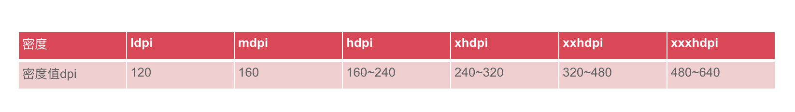

[TOC]

# 安卓面试指南

### 参考链接

* [Android面试指南](https://github.com/stormzhang/android-interview-questions-cn)

### 四大组件

#### 安卓的四大组件

* Activity，Service，BroadcastReceiver广播接收者，ContentProvider内容提供者

#### Activity的生命周期和相关问题


(1)各种场景Activity的生命周期：

* 启动Activity：onCreate()---onStart()---onResume()，Activity进入运行状态
* 用户锁屏或者新的Activity不完全覆盖在上面：onPause()    回到之前Activity或者解锁屏：onResume()
* Activity的跳转或者按Home键：onPause()--onStop()    用户后退回到Activity：onRestart()---onStart()---onResume()
* 用户结束Activity或者activity处于后台且系统内存不足时：onStop()    再次进入：onCreate()---onStart()---onResume()

(2)如果Activity被销毁了，此时AsynTask执行结束并且返回结果，会有异常吗？

* 当Activity重启时，AsyncTask中对该Activity的引用是无效的，因此onPostExecute()就不会起作用，若AsynTask正在执行，会报 view not attached to window manager 异常。为了是两者的生命周期一致(同时被销毁)，我们可以在Activity的onDestory()方法中调用AsyncTask.cancel()方法

(3)内存不足时，系统会杀死Activity,如果需要保存一些临时状态，在那个方法中进行？(临时)

* Activity的 onSaveInstanceState() 和 onRestoreInstanceState()并不是生命周期方法,不同于 onCreate()、onPause()等生命周期方法，它们并不一定会被触发。当应用遇到意外情况（如：内存不足、用户直接按Home键、旋转屏幕、关闭屏幕）由系统销毁一个Activity，onSaveInstanceState() 会被调用。但是当用户主动去销毁一个Activity时，例如在应用中按返回键，onSaveInstanceState()就不会被调用。除非该activity是被用户主动销毁的，通常onSaveInstanceState()只适合用于保存一些临时性的状态。

(4)Activity的四种launchMode：standard，singleTop，singleTask，singleInstance。

* standard：默认的方式，每次都会创建Activity实例，然后放进任务栈中
* singleTop：如果任务栈中刚好Activity实例处在栈顶，则重用此Activity实例，处于栈中或者不存在此Activity实例，都需要创建新的Activity实例
* singleTask：如果栈中存在此Activity实例，会重用此Activity实例，释放位于上方的实例，使其位于栈顶。如果不存在，就创建新的放入
* singleInstance：在一个新的栈中创建一个新的Activity实例，并且只有他一个，下次激活，就会重用此栈中的Activity实例。适合多个应用共享一个应用

(5)Activity启动Service的两种方式

* startService：生命周期和调用者不同，如果启动者未调用stopService就退出了，Service仍在运行

* bindService：生命周期和调用者相同，调用者退出时，Service就会调用unBind---onDestory

#### Fragment的生命周期和相关问题

|                       Fragment生命周期                       |                        Fragment流程图                        |
| :----------------------------------------------------------: | :----------------------------------------------------------: |
|  |  |

(1)一个Activity可以有多个Fragment，一个Fragment可以在多个Activity中；可以动态的添加，替换和移除Fragment
(2)静态的使用Fragment

* 继承Fragment，重写onCreateView决定Fragment的布局
* 在Activity中声明Fragment

#### 广播(BroadcastReceiver)的两种注册方式：动态注册和静态注册的区别？

* 静态注册：在AndroidManifest.xml中注册，当程序退出的时候，Receiver仍旧会接受广播并进行处理。其不会受程序的生命周期影响
* 动态注册：在代码中动态注册，当程序退出的时候，就无法接受广播了

### 数据存储

#### 安卓的存储方式及相关问题

(1)安卓的常见存储方式：使用Sqlite本地数据库存储数据，使用SharedPreferences存储数据，使用文件存储数据，使用网络存储数据，使用ContentProvider存储数据

* SharedPreferences：一种数据存储方式，其本质就是xml文件存储键值对数据，SharedPreferences对象本身只能获取数据而不支持存储和修改，存储修改是通过Editor对象实现。
* Sqlite：Sqlite轻量级数据库，支持Sql语句，最常用的一种存储方式
* File： 通过Java.io.FileInputStream和java.io.FileOutputStream这两个类来实现对文件的读写，常用于存储数据量较大的数据，缺点时更新数据比较困难
* ContentProvider：主要用于在不同的应用程序之间实现数据共享的功能，可以对某些部分数据进行共享，从而更加安全
* 网络存储：不同于存在本地设备中，通过网络来实现数据的存储和获取

(2)ContentProvider：在安卓中为了数据的安全，数据是私有的。所以为了解决不同程序之间的数据进行数据交换，就需要使用ContentProvider。其他应用程序就可通过ContentResolver来操作ContentProvider暴露的数据，不管这个程序是否启动，其他程序都可以通过接口来对数据的进行增删改查(使用URI的方式进行提供数据和访问数据)。

* 定义自己的ContentProvider类，该类需要继承Android提供的ContentProvider基类。
* 在AndroidManifest.xml文件中注册个ContentProvider，注册ContenProvider时需要为它绑定一个URL。 例： android:authorities=”com.myit.providers.MyProvider” /> 说明:authorities就相当于为该ContentProvider指定URL。 注册后，其他应用程序就可以通过该Uri来访问MyProvider所暴露的数据了。
* 使用ContentResolver操作数据，Context提供了如下方法来获取ContentResolver对象。 一般来说，ContentProvider是单例模式，当多个应用程序通过ContentResolver来操作 ContentProvider提供的数据时，ContentResolver调用的数据操作将会委托给同一个ContentProvider处理。 使用ContentResolver操作数据只需两步： a.调用Activity的ContentResolver获取ContentResolver对象。 b.根据需要调用ContentResolver的insert()、delete()、update()和query()方法操作数据即可

### Android消息机制

#### Handler和Message和MessageQueue和Looper源码解析

* 详情请点击[Handler和Message和MessageQueue和Looper](../Android组件内核/Android消息机制/Handler和Message和MessageQueue和Looper.md)

### Context的区别


(1)三类的Context：Activity，Service，Application(Application就是程序的上下文对象，只有一个)

(2)getApplication()用来获取Application实例的，但是这个方法只有在Activity和Service中才能调用的到。那么也许在绝大多数情况下我们都是在Activity或者Service中使用Application的，但是如果在一些其它的场景，比如BroadcastReceiver中也想获得Application的实例，这时就可以借助getApplicationContext()方法，getApplicationContext()比getApplication()方法的作用域会更广一些，任何一个Context的实例，只要调用getApplicationContext()方法都可以拿到我们的Application对象。

### 界面相关

#### 安卓的布局方式

* LinearLayout(线性布局)，RelativeLayout(相对布局)，FrameLayout(框架布局)，AbsoluteLayout(绝对布局)，TableLayout(表格布局)，GridLayout(网格布局)，ConstraintLayout(约束布局)

* 尽量使用ConstraintLayout，其次尽量使用LinearLayout和FrameLayout少用其他的，尽量使用padding少用margin

#### 安卓的三种动画

* 逐帧动画(Drawable Animation)： 加载一系列Drawable资源来创建动画，简单来说就是播放一系列的图片来实现动画效果，可以自定义每张图片的持续时间
* 补间动画(Tween Animation)： Tween可以对View对象实现一系列简单的动画效果，比如位移，缩放，旋转，透明度等等。但是它并不会改变View属性的值，只是改变了View的绘制的位置，比如，一个按钮在动画过后，不在原来的位置，但是触发点击事件的仍然是原来的坐标。
* 属性动画(Property Animation)： 动画的对象除了传统的View对象，还可以是Object对象，动画结束后，Object对象的属性值被实实在在的改变了

#### 平时如何有使用屏幕适配吗？原理是什么呢？

* 平时的屏幕适配一般采用的头条的屏幕适配方案。简单来说，以屏幕的一边作为适配，通常是宽。

* 原理：`px`和`dp`之间的关系是

  ```
  px = dp * (dpi / 160)
  ```
  
* 假设UI给的设计图屏幕宽度基于360dp，那么设备宽的像素点已知，即px，dp也已知，360dp，所以`dp=density px`，之后根据这个修改系统中跟`density`相关的知识点即可。

#### Bitmap的内存计算方式

在已知图片的长和宽的像素的情况下，影响内存大小的因素会有**资源文件位置和像素点大小**。

**像素点大小**： 常见的像素点有：

- ARGB_8888：4个字节
- ARGB_4444、ARGB_565：2个字节

**资源文件位置**： 不同dpi对应存放的文件夹



比如一个一张图片的像素为`180*180px`，`dpi`(设备独立像素密度)为320，如果它仅仅存放在`drawable-hdpi`，则有：

```
横向像素点 = 180 * 320/240 + 0.5f = 240 px
纵向像素点 = 180 * 320/240 + 0.5f = 240 px
```

如果 如果它仅仅存放在`drawable-xxhdpi`，则有：

```
横向像素点 = 180 * 320/480 + 0.5f = 120 px
纵向像素点 = 180 * 320/480 + 0.5f = 120 px
```

所以，对于一张`180*180px`的图片，设备dpi为320，资源图片仅仅存在`drawable-hdpi`，像素点大小为`ARGB_4444`，最后生成的文件内存大小为：

```
横向像素点 = 180 * 320/240 + 0.5f = 240 px
纵向像素点 = 180 * 320/240 + 0.5f = 240 px
内存大小 = 240 * 240 * 2 = 115200byte 约等于 112.5kb
```

#### Bitmap的高效加载？

Bitmap的高效加载在Glide中也用到了，思路：

1. 获取需要的长和宽，一般获取控件的长和宽。
2. 设置`BitmapFactory.Options`中的`inJustDecodeBounds`为true，可以帮助我们在不加载进内存的方式获得`Bitmap`的长和宽。
3. 对需要的长和宽和Bitmap的长和宽进行对比，从而获得压缩比例，放入`BitmapFactory.Options`中的`inSampleSize`属性。
4. 设置`BitmapFactory.Options`中的`inJustDecodeBounds`为false，将图片加载进内存，进而设置到控件中。

### 安卓的几种进程

(1)五种进程

* 前台进程：与用户正在正在交互的Activity或者Activity启动的Service，如果系统内存不足时最后才会被杀死
* 可见进程：处于暂停状态(onPause)的Activity或者其绑定的Service，即用户可见，但由于失去焦点而不能与用户交互
* 服务进程：其中运行着startService方式启动的Service，虽然用户不可见，但是是用户关心的，比如在非音乐界面播放的音乐或者在非下载页面下载的文件，当系统内存需要运行前面的两种进程时才会终止服务进程
* 后台进程：其中执行onStop方法终止的程序，但是却不是用户关心的，例如后台挂着的QQ，这样的进程如果系统没有内存了，会被首先杀死
* 空进程：不包括任何应用进程的程序组件的进程，这样的进程系统一般不会让他存在

(2)如何避免Service在后台被杀死

* 调用startForegound，让你的Service所在的线程成为前台进程
* Service的onStartCommond返回START_STICKY或START_REDELIVER_INTENT
* Service的onDestroy里面重新启动自己
* 设置守护进程拉起service

### MVC，MVP，MVVM区别

|                        MVC                         |                        MVP                         | MVVM                                                 |
| :------------------------------------------------: | :------------------------------------------------: | ---------------------------------------------------- |
|  |  |  |

(1)MVC

* M(Model)模型：数据保存
* V(View)视图：用户界面
* C(Controller)控制器：业务逻辑
* 各部分之间的通信：View传送指令到Controller；Controller完成业务逻辑之后，要求Model改变状态； Model将新的数据发送给View，改变界面，用户得到反馈，所有的通信都是单向的

(2)MVP

* MVP把Controller改成了Presenter
* 各部分之间的通信：各部分之间的通信都是双向的；View和Model不发生联系，都通过Presenter传递；View处于被动状态，即没有任何主动性，而Presenter非常厚，所有的逻辑都部署在那

(3)MVVM

* Presenter改成ViewModel，基本上与MVP是一样的
* 唯一的区别是：View和ViewModel是双向绑定的，View的变动自动反应在ViewModel上

### ListView的相关问题

(1)ListView卡顿的原因及优化策略

* 重用convertView：通过复用convertView减少不必要View的创建
* 减少findViewById操作：封装成ViewHolder静态类，通过convertView的getTag和setTag方法将view和holder绑定起来，避免不必要的findviewById操作
* 避免在getView中进行耗时操作：例如加载本地 Image 需要载入内存以及解析 Bitmap ，都是比较耗时的操作，如果用户快速滑动listview，会因为getview逻辑过于复杂耗时而造成滑动卡顿现象。用户滑动时候不要加载图片，待滑动完成再加载，可以使用这个第三方库glide
* Item的布局层次结构尽量简单，避免布局太深或者不必要的重绘
* 使用 RecyclerView 代替listview： 每个item内容的变动，listview都需要去调用notifyDataSetChanged来更新全部的item，太浪费性能了。RecycleView可以实现当个item的局部刷新，并且引入了增加和删除的动态效果，在性能上和定制上都有很大的改善

(2)ListView和RecyclerView的区别

* RecyclerView支持横水平方向，竖直方向滚动列表，支持交叉式网格的列表滚动(瀑布流效果)，支持网格的水平竖直方向的滚动；而ListView从初衷上只支持竖直方向上的滚动
* RecyclerView必须使用使用ViewHolder，在RecyclerView中这是必要的；在ListView中ViewHolder是推荐的方式，没有也是可以的
* RecyclerView动画设置比较简单，RecyclerView.ItemAnimator则被提供用于在RecyclerView添加、删除或移动item时处理动画效果。同时，如果你比较懒，不想自定义ItemAnimator，你还可以使用DefaultItemAnimator；而ListView比较麻烦，需要使用ViewPropertyAnimator属性动画来实现

### Bundle和Intent传值

* 详情请点击[关于Intent和Binder传值](Android组件内核/Intent/关于Intent和Binder传值.md)

### 安卓进阶篇

#### 1.Android中Binder解析

* [Binder解析](../Android组件内核/跨进程通信IPC/Binder解析.md)
* [基于AIDL的Messenger](../Android组件内核/跨进程通信IPC/基于AIDL的Messenger.md)
* [常见IPC方式比较](../Android组件内核/跨进程通信IPC/常见IPC方式比较.md)

#### 2.OOM

* OOM(Out Of Memory)：内存用完了，源于java.lang.OutOfMemoryError。(Thrown when the Java Virtual Machine cannot allocate an object because it is out of memory, and no more memory could be made available by the garbage collector.)当JVM没有足够的内存来为对象分配空间并且垃圾回收器也已经没有空间可回收时，就会抛出这个error。
* LeakCanary的使用：[参考文章](https://www.liaohuqiu.net/cn/posts/leak-canary-read-me)

#### 3.ANR

* ANR(Application Not Responding)，就是程序未响应，如果应用无法响应用户的输入，则会弹出对话框，用户选择终止此程序或者等待程序

* 什么情况下会发生ANR
  
    ```java
    KeyDispatchTimeout(5 seconds) --应用在五秒内未响应用户的触摸或按键事件
    BroadcastTimeout(10 seconds) --BroadcastReceiver在十秒内无法处理完成
    ServiceTimeout(20 secends) --小概率事件 Service在特定的时间内无法处理完成  
    ```

* 在主线程中执行哪些操作会导致ANR
  
	```java
  高耗时的操作，如图像转换
  磁盘读写，数据库读写操作
  大量的创建新对象
	```

* 如何避免ANR

  ```java
  UI线程只做UI操作
  使用子线程处理耗时操作
  尽量使用handler来进行处理
  ```

#### 4.JVM和DVM和ART的比较

* 详情请点击[JVM和DVM和ART的比较](https://github.com/nullWolf007/Notes/blob/master/Java/Java%E7%9F%A5%E8%AF%86%E7%B2%BE%E5%8D%8E/jvm/JVM%E5%92%8CDVM%E5%92%8CART%E7%9A%84%E6%AF%94%E8%BE%83.md)

#### 5.Serializable和Parcelable相关

* 详情请点击[Serializable和Parcelable的理解和区别](https://github.com/nullWolf007/Android/blob/master/%E8%BF%9B%E9%98%B6/%E7%9B%B8%E4%BC%BC%E6%AF%94%E8%BE%83/serializable%E5%92%8Cparcelable.md)

#### 7.Context深入理解及源码解析

* 详情请点击[Context深入理解及源码解析](https://github.com/nullWolf007/Android/blob/master/%E8%BF%9B%E9%98%B6/%E5%90%AF%E5%8A%A8%E7%9B%B8%E5%85%B3(Context%EF%BC%8C%E8%B7%A8%E8%BF%9B%E7%A8%8B%E7%AD%89)/Context%E6%B7%B1%E5%85%A5%E7%90%86%E8%A7%A3%E5%8F%8A%E6%BA%90%E7%A0%81%E8%A7%A3%E6%9E%90.md)

#### 8.APP的启动过程

* 详情请点击[APP的启动过程](https://github.com/nullWolf007/Android/blob/master/%E8%BF%9B%E9%98%B6/%E5%90%AF%E5%8A%A8%E7%9B%B8%E5%85%B3(Context%EF%BC%8C%E8%B7%A8%E8%BF%9B%E7%A8%8B%E7%AD%89)/APP%E7%9A%84%E5%90%AF%E5%8A%A8%E8%BF%87%E7%A8%8B.md)

#### 9.ActivityThread深入理解及源码解析

* 详情请点击[ActivityThread深入理解及源码解析](https://github.com/nullWolf007/Android/blob/master/%E8%BF%9B%E9%98%B6/%E5%90%AF%E5%8A%A8%E7%9B%B8%E5%85%B3(Context%EF%BC%8C%E8%B7%A8%E8%BF%9B%E7%A8%8B%E7%AD%89)/ActivityThread%E6%B7%B1%E5%85%A5%E7%90%86%E8%A7%A3%E5%8F%8A%E6%BA%90%E7%A0%81%E8%A7%A3%E6%9E%90.md)

#### 10.安全知识库

* 详情请点击[安全知识库](https://github.com/nullWolf007/Android/blob/master/%E8%BF%9B%E9%98%B6/%E5%AE%89%E5%85%A8%E7%9B%B8%E5%85%B3/%E5%AE%89%E5%85%A8%E7%9F%A5%E8%AF%86%E5%BA%93.md)

#### 11.内存泄漏

* 详情请点击[**内存泄漏相关**](https://github.com/nullWolf007/Android/blob/master/%E8%BF%9B%E9%98%B6/%E5%86%85%E5%AD%98%E7%9B%B8%E5%85%B3/%E5%86%85%E5%AD%98%E6%B3%84%E6%BC%8F%E7%9B%B8%E5%85%B3.md)

#### 12.View的事件体系及原理

* 详情请点击[**View的事件体系及原理**](https://github.com/nullWolf007/Android/blob/master/%E8%BF%9B%E9%98%B6/%E7%95%8C%E9%9D%A2%E7%9B%B8%E5%85%B3(View%2CUI%E6%8E%A7%E4%BB%B6%E7%AD%89)/View%E7%9A%84%E4%BA%8B%E4%BB%B6%E4%BD%93%E7%B3%BB%E5%8F%8A%E5%8E%9F%E7%90%86.md)

#### 13.RemoteViews解析

* 详情请点击[**RemoteViews解析**](https://github.com/nullWolf007/Android/blob/master/%E8%BF%9B%E9%98%B6/%E7%95%8C%E9%9D%A2%E7%9B%B8%E5%85%B3(View%2CUI%E6%8E%A7%E4%BB%B6%E7%AD%89)/RemoteViews%E8%A7%A3%E6%9E%90.md)

#### 14. AAPT2解析

* 详情请点击[AAPT2的解析](https://github.com/nullWolf007/Android/blob/master/%E8%BF%9B%E9%98%B6/AS%E8%87%AA%E5%B8%A6%E5%B7%A5%E5%85%B7/AAPT2%E7%9A%84%E8%A7%A3%E6%9E%90.md)

#### 15.Lambda表达式及方法引用

* 详情请点击[Lambda表达式及方法引用](https://github.com/nullWolf007/Notes/blob/master/Java/Java%E7%9F%A5%E8%AF%86%E7%B2%BE%E5%8D%8E/%E6%96%B0%E7%89%B9%E6%80%A7/Lambda%E8%A1%A8%E8%BE%BE%E5%BC%8F%E5%8F%8A%E6%96%B9%E6%B3%95%E5%BC%95%E7%94%A8.md)

#### 16. RxJava+Retrofit+OkHttp框架解析

* 详情请点击[**RxJava2教程**](https://github.com/nullWolf007/Android/blob/master/%E8%BF%9B%E9%98%B6/%E4%B8%89%E6%96%B9%E6%A1%86%E6%9E%B6%E7%AD%89%E8%AF%A6%E8%A7%A3/RxJava2%E6%95%99%E7%A8%8B.md)
* 详情请点击[**Retrofit2教程**](https://github.com/nullWolf007/Android/blob/master/%E8%BF%9B%E9%98%B6/%E4%B8%89%E6%96%B9%E6%A1%86%E6%9E%B6%E7%AD%89%E8%AF%A6%E8%A7%A3/Retrofit2%E6%95%99%E7%A8%8B.md)
* 详情请点击[**OkHttp详解**](https://github.com/nullWolf007/Android/raw/master/%E8%BF%9B%E9%98%B6/%E7%BD%91%E7%BB%9C%E7%9B%B8%E5%85%B3/OkHttp%E8%AF%A6%E8%A7%A3.md)
* 详情请点击[**Android四种网络请求方式**](https://github.com/nullWolf007/Android/blob/master/%E8%BF%9B%E9%98%B6/%E7%BD%91%E7%BB%9C%E7%9B%B8%E5%85%B3/Android%E5%9B%9B%E7%A7%8D%E7%BD%91%E7%BB%9C%E8%AF%B7%E6%B1%82%E6%96%B9%E5%BC%8F.md)

#### 17.AOP和IOC

* 详情请点击[APT解析](https://github.com/nullWolf007/Android/blob/master/进阶/AOP和IOC/IOC/APT解析.md)
* 详情请点击[Android注解框架解析](https://github.com/nullWolf007/Android/blob/master/进阶/AOP和IOC/IOC/Android注解框架解析.md)
* 详情请点击[Java反射机制](https://github.com/nullWolf007/Android/blob/master/进阶/AOP和IOC/IOC/Java反射机制.md)
* 详情请点击[Java代理(Proxy)模式](https://github.com/nullWolf007/Android/blob/master/进阶/AOP和IOC/AOP/Java代理(Proxy)模式.md)


